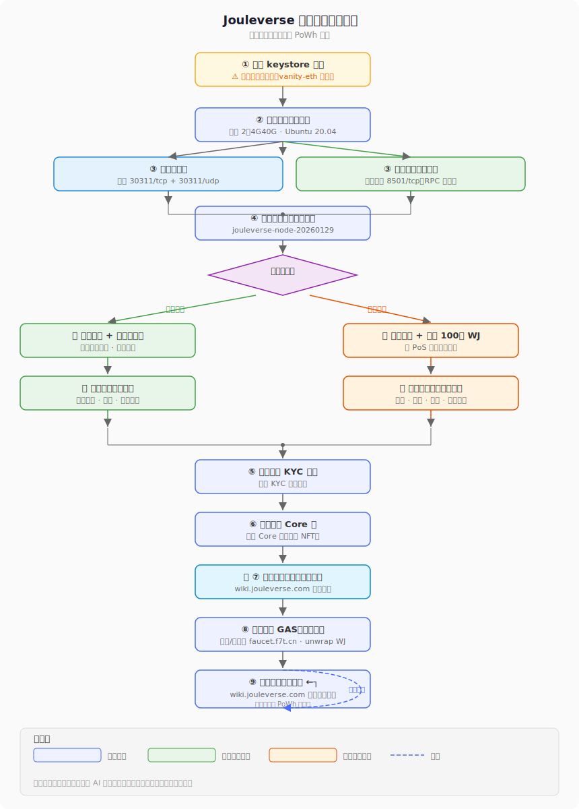

# Jouleverse Mainnet 节点搭建指南（2026版）

## 旧版入口

[Jouleverse Mainnet 节点搭建指南（2024版）](how-to-setup-jouleverse-node-2024.md)

## PoWh激励标准

主网记账节点或见证节点要求独立主机、独立IP运行，每节点每月计5h算力。

获得节点激励检查清单：
1. ✅ 节点搭建完毕，正常运行，登记入网，完成审计
2. ✅ [完成高级KYC并获得Core 🆔（链上 NFT）](how-to-register-core-and-check-in.md#1-完成高级-kyc)
3. ✅ [每月及时完成链上签到，证明维护人活跃](how-to-register-core-and-check-in.md#4-每月链上签到)

## 🤖 AI 辅助提示

> 如果你正在使用 AI 助手（如 ChatGPT、Claude 等），**可将本文档的链接直接复制给 AI 助手**，让其学习文档内容后协助你完成节点搭建的每一步操作。

## 完整流程总览

下面的流程图帮助你快速了解从零开始到持续获得激励的完整路径：



> 💡 步骤 ⑤-⑨ 的详细操作请参考 → [入网后：申请Core 🆔 与 每月链上签到指南](how-to-register-core-and-check-in.md)

## 简明步骤

1. 准备keystore账户，用于签名出块 **（仅记账节点需要）**
2. 准备独立云主机、独立IP，最低配置（2核4G内存40G硬盘），Ubuntu 20.04 Linux带docker，防火墙打开30311/tcp和30311/udp （见证节点请再打开8501/tcp）【注意与testnet端口号皆有不同】
3. 下载节点软件包 jouleverse-node-20260129.tar.gz ，并启动节点
4. 【仅记账节点】在节点群里通知其他节点投票，批准自己节点入网
5. 入网后，填写主网节点信息采集表，通知审计负责人安排审核

---

## 账户准备

> **⚠ 仅记账节点需要。**

keystore是一种把私钥加密保存在文本文件中的技术。keystore文件是加密保存了私钥的文本文件（json格式）。可以用 https://vanity-eth.tk/ 这个工具生成。记住keystore对应的地址0xAAA...（下文称为“签块地址”），并把keystore文件下载到电脑上，重命名为mainnet.keystore 。请妥善保管keystore文件并记住其解锁密码。稍后需要将该文件放到云主机上面去。

[《教程：使用Vanity-ETH地址生成器创建keystore账户》🔗](https://mp.weixin.qq.com/s/MUBWPodZ8V3_qqOcSTs8Aw)

注意：不要混用测试网的keystore。

## 购买并配置云主机

配置最低2核4G内存40G硬盘。系统镜像选用Ubuntu 20.04 LTS + Docker的版本。

要求：全新主机，独立IP地址。主网记账节点云主机请确保至少1年或以上有效期，以持续稳定运行。

### 配置云主机防火墙

在云主机管理后台，找到防火墙配置，关闭所有非必要的端口，打开30311/tcp（即：端口号 30311 协议 tcp）和30311/udp（端口号 30311 协议 udp），分别用于节点数据传输和节点组网信令交换。

另外，见证节点请打开8501/tcp（用于响应rpc请求）和ICMP（用于响应ping）。目前非必需。

### 创建虚拟内存(swap)【建议选做】

创建虚拟内存，可以避免云主机因内存不足而卡死的情况。

具体请参考Jeff的文档[如何创建虚拟内存(Swap)](how-to-make-swap.md)

### 拉取docker镜像

```
# 请执行命令，拉取docker镜像（如果拉过就不需要了）：
sudo docker pull ubuntu:20.04
```

### 下载节点软件包

```
# 从云主机管理后台登陆云主机终端，从github repo下载rc 20260129版本的软件包
wget https://github.com/Jouleverse/jouleverse-node/archive/refs/tags/jouleverse-node-20260129.tar.gz

# 注：如果无法下载，可换用镜像
wget http://bootnode.jnsdao.com/mirror/jouleverse-node-20260129.tar.gz

# 检查shasum
sha256sum jouleverse-node-20260129.tar.gz

# 结果应该是 66f5228b2f0fd6748f053270d98662258a8018a3999549a21fc5132d50cf4b73  jouleverse-node-20260129.tar.gz
# 这证明软件包未损坏或被篡改。

# 解压缩并更改目录名
tar xvfz jouleverse-node-20260129.tar.gz && mv jouleverse-node-jouleverse-node-20260129 jouleverse-node-20260129
```

### 设置脚本路径便捷访问（只需要做一次）

A. 如果你要搭建的是见证节点：

```
# 为见证节点管理脚本设置执行权限
chmod +x ~/jouleverse-node-20260129/scripts/jnode_witness

# 添加别名快捷方式
echo "alias jnode='~/jouleverse-node-20260129/scripts/jnode_witness'" >> ~/.bash_profile

# 让快捷方式立即生效
source ~/.bash_profile

# 测试一下管理脚本是否可以运行
jnode

# 应该出现管理脚本的使用说明，这证明它可以正常运行了
```

B. 如果你要搭建的是记账节点：

```
# 为记账节点管理脚本设置执行权限
chmod +x ~/jouleverse-node-20260129/scripts/{jnode_miner,miner_init.sh,clef_entrypoint.sh}

# 添加别名快捷方式
echo "alias jnode='~/jouleverse-node-20260129/scripts/jnode_miner'" >> ~/.bash_profile

# 让快捷方式立即生效
source ~/.bash_profile

# 测试一下管理脚本是否可以运行
jnode

# 应该出现管理脚本的使用说明，这证明它可以正常运行了
```

---
Note: **注意：下面，根据你是要搭建见证节点还是记账节点，在“选项A”和“选项B”两个里面选一个即可！**

## 选项A：搭建见证节点

Note: **注意：下面，根据你是第一次搭建见证节点还是升级节点，在“A1”和“A2”两个里面选一个即可！**

#### A1：第一次搭建见证节点

Note: **警告：如果只是重启/升级节点而不是第一次搭建，请不要重新初始化数据目录！否则可能会造成节点信息变化，审计报错！**

```
# 创建数据目录
mkdir ~/data

# 初始化数据目录
jnode init

# 备份nodekey（每次重建节点需要恢复nodekey，这将恢复节点id，以保持审计正确）
jnode backup

# 启动见证节点（注意：节点启动后自动后台运行，关闭远程终端后会持续运行）
jnode start

# 确认节点成功运行
jnode status

# 应该看到名为joulverse-geth的容器正在运行

# 检查节点版本
jnode console admin.nodeInfo | grep name

# 上述命令应输出结果：  name: "Geth/v1.11.4-jouleverse-9dfa34e5-20240229/tag-w20260129/linux-amd64/go1.19.1",
```

#### A2：升级见证节点

Note: **警告：如果只是重启/升级节点而不是第一次搭建，请不要重新初始化数据目录！否则可能会造成节点信息变化，审计报错！**

```
# 首先，确认已经下载了新版本的节点软件包，并正确解压缩

# 优雅地停止当前节点的运行。此处采取通知geth退出的方式，而不是直接stop docker，避免数据损坏
jnode stop

# 确认docker已经停止运行。结果应该显示为空，没有什么在运行
jnode status

# 清除旧容器(container)。记得回答Y (Yes，是)
jnode cleanup

# 重新用新版本软件包启动节点
jnode start

# 确认节点成功运行
jnode status

# 应该看到名为joulverse-geth的容器正在运行

# 检查节点版本
jnode console admin.nodeInfo | grep name

# 上述命令应输出结果：  name: "Geth/v1.11.4-jouleverse-9dfa34e5-20240229/tag-w20260129/linux-amd64/go1.19.1",
```

### 见证节点审计入网

如果你想让你的见证节点加入核心网络并获得WJ空投激励的话，那么接下来你还需要联系审计人员进行审计和入网登记。

#### 1. 节点同步完成后，截图报告运行日志（最新区块高度）

```
# 观察后台运行节点的日志：
jnode watch

# 持续观察节点运行日志，应该能够找到其他节点并开始同步区块链，出现类似这样的日志：
# INFO [09-28|12:52:39.426] Imported new chain segment               blocks=2048 txs=2 mgas=0.042 elapsed=3.446s      mgasps=0.012 number=37943 hash=a43ebf..37a8c0 age=11mo3w42m dirty=2.69KiB
# INFO [09-28|12:52:43.182] Imported new chain segment               blocks=2048 txs=13 mgas=0.273 elapsed=3.732s      mgasps=0.073 number=39991 hash=110c48..f0999f age=11mo2w6d  dirty=2.69KiB
# INFO [09-28|12:52:46.944] Imported new chain segment               blocks=2048 txs=3  mgas=0.063 elapsed=3.747s      mgasps=0.017 number=42039 hash=1a0a88..98d165 age=11mo2w6d  dirty=2.69KiB
# INFO [09-28|12:52:50.256] Imported new chain segment               blocks=2048 txs=1  mgas=0.021 elapsed=3.291s      mgasps=0.006 number=44087 hash=3ed781..448020 age=11mo2w5d  dirty=2.69KiB

# 日志不断产生，持续同步区块，则说明节点正常运行了！（随时按 Ctrl + C 退出查看日志 —— 不会中止节点运行）

# 查看本节点区块高度
jnode console eth.blockNumber

# 打开区块链浏览器（比如https://jscan.jnsdao.com）报告的最新区块高度，对比本节点区块高度

# 待若干小时后，区块链同步完成，追上最新区块高度。查看运行日志，并截图【节点运行日志截图】，发到节点预备群中向审计人报告情况。
```

#### 2. 添加审计节点，截图报告连接信息

接下来还要建立一下到审计节点（自2024.1.16起由节点 @Jeff 进行审计）的连接并截图报告。

```
# 进入后台运行节点的geth console控制台
jnode console

# 在geth console执行下述命令
admin.addPeer('enode://f3e4e524d89b4cdb9ee390d9485cee4d6a5e9a260f5673cab118505cc3e69fe8365bc00434222d27fe4082ca798b13ad8e7e139d1315f635fd0e46dbe96fa809@jeff.bootnode:30311')

# 添加后，稍等片刻，执行下述命令，确认已经和审计节点建立了连接
admin.peers.filter(n => n.id == '36d1c18a197fea99e9b55b111b03ab03866367838b3017ae91984e0648e3f677')

# 应该能够看到正确的审计节点的连接信息，类似于：
# [{
#     caps: ["eth/66", "eth/67"],
#     enode: "enode://f3e4e524d89b4cdb9ee390d9485cee4d6a5e9a260f5673cab118505cc3e69fe8365bc00434222d27fe4082ca798b13ad8e7e139d1315f635fd0e46dbe96fa809@43.136.53.164:30311",
#     id: "36d1c18a197fea99e9b55b111b03ab03866367838b3017ae91984e0648e3f677",
#     name: "Geth/v1.11.3-jouleverse-5d8dcb81-20230926/linux-amd64/go1.16.2",
#     network: {
#       inbound: false,
#       localAddress: "172.17.0.2:35036",
#       remoteAddress: "43.136.53.164:30311",
#       static: true,
#       trusted: false
#     },
#     protocols: {
#       eth: {
#         difficulty: 5379019,
#         head: "0x702d6211fc6a2a277fbc16a3890f5881bb5bc6ef145867e535cbeacc61febcb3",
#         version: 67
#       }
#     }
# }]

# 把该命令的执行结果截图【审计节点连接截图】并发到节点预备群中向审计人报告情况。
```

#### 3. 查看本节点信息，记录enode、id、ip等关键信息，并截图报告

```
# 查看本节点信息，记录enode、id、ip等关键信息
jnode console admin.nodeInfo

# 截图【本节点信息截图】并发到节点预备群中向审计人报告
```

#### 见证节点入网流程简要总结

1. 搭建节点并运行，查看日志，等待若干小时，区块同步到最新高度
2. 将上面的三张截图【节点运行日志截图】【审计节点连接截图】【本节点信息截图】，发到节点预备群，请大家帮忙审查，确认运行无误后，填写[节点信息登记表](https://docs.qq.com/form/page/DTEp2cEdsa0lTelB0)
3. 填表完成后，在节点预备群提请审计节点将你的见证节点加入审计列表
4. 审计通过后，本人需进行高级KYC登记，[申请加入jouleverse core（核心贡献者组），获取Core 🆔并每月完成链上签到](how-to-register-core-and-check-in.md)，开始享受PoWh机制激励

恭喜成功入网！

---

> 📖 **下一步：** [入网后：申请Core 🆔 与 每月链上签到指南 →](how-to-register-core-and-check-in.md)

## 选项B：搭建记账节点

Note: **注意：下面，根据你是第一次搭建记账节点还是升级节点，在“B1”和“B2”两个里面选一个即可！**

#### B1：第一次搭建记账节点

Note: **警告：如果只是重启/升级节点而不是第一次搭建，请不要重新初始化数据目录！否则可能会造成节点信息变化，审计报错！**

```
# 创建数据目录
mkdir ~/data

# 把主网签块账户keystore文件粘贴并创建到主机上
cat > ~/data/mainnet.keystore
复制粘贴主网签块账户keystore内容，按Ctrl+D，保存退出

# 检查一下所创建的keystore内容，确认无误【警告：不要截屏向他人展示！】
cat ~/data/mainnet.keystore

# 内容应该类似这样：
# {"address":"0x38885d668d422e07b1d3b205f021b2d4363051e9","crypto":{"kdf":"pbkdf2","kdfparams":{"c":262144,"dklen":32,"prf":"hmac-sha256","salt":"6a2017.......41d4e5aa516f706a"},"cipher":"aes-128-ctr","ciphertext":"12b662d.....e332","cipherparams":{"iv":"a29fb2....6d4f95769822"},"mac":"85e521....63f8d0b"},"id":"a30fe...-....-....-....-....bc57cbe2e","version":3}

# 开始初始化Clef签名机以及geth数据目录
jnode init

# 注意观察界面提示信息，并按照提示信息小心操作：
# 
# [INFO] 步骤1: 初始化clef签名机
# [INFO] 步骤1.1: 初始化Clef加密存储区 （❗️需要按提示正确输入信息）
# 请按照提示操作:
# 1. 输入并确认clef加密密码（两次）
# [INFO] 步骤1.2: 设置账户密码（❗️需要按提示正确输入信息）
# 请按照提示操作:
# 1. 输入keystore解锁密码（两次）
# 2. 输入clef加密密码
# [INFO] 步骤1.3: 验证规则脚本（❗️需要按提示正确输入信息）
# 请按照提示操作:
# 1. 输入clef加密密码
# [INFO] 步骤1: 初始化geth数据目录
# [INFO] 步骤1.1: 初始化区块链 （✅自动完成，无需操作）
# [INFO] 步骤2.2: 复制keystore文件（✅自动完成，无需操作）
#
# ==========================================
# [INFO] 所有初始化步骤已完成！
# ==========================================
# docker已退出
# 节点初始化完成

# 备份nodekey（每次重建节点需要恢复nodekey，这将恢复节点id，以保持审计正确）
jnode backup

# 启动记账节点。注意：节点启动后自动后台运行，关闭远程终端后会持续运行。
jnode start

# 根据提示，输入Clef加密密码

# 确认节点成功运行
jnode status

# 应该看到名为joulverse-geth的容器正在运行

# 检查节点版本
jnode console admin.nodeInfo | grep name

# 上述命令应输出结果：  name: "Geth/v1.11.4-jouleverse-9dfa34e5-20240229/tag-m20260129/linux-amd64/go1.19.1",
```

#### B2：升级记账节点

Note: **警告：如果只是重启/升级节点而不是第一次搭建，请不要重新初始化数据目录！否则可能会造成节点信息变化，审计报错！**

Note: 首次从2024版节点包首次升级到2026版节点包，需要保留数据但第一次初始化clef签名机，建议先停止节点（指令：jnode stop）、备份data数据目录（指令：sudo cp -R ~/data ~/data.2024），然后按照新节点开始初始化（指令：jnode init）：<br>第一次警告“是否继续重新初始化？(y/N)”，回答y同意继续初始化；<br>按照提示信息完成Clef初始化；<br>然后，第二次警告“是否继续强制重新初始化Geth数据目录？(y/N)”直接回车跳过Geth初始化）

```
# 首先，确认已经下载了新版本的节点软件包，并正确解压缩

# 优雅地停止当前节点的运行。此处采取通知geth退出的方式，而不是直接stop docker，避免数据损坏
jnode stop

# 确认docker已经停止运行。结果应该显示为空，没有什么在运行
jnode status

# 清除旧容器(container)。记得回答Y (Yes，是)
jnode cleanup

# 重新用新版本软件包启动节点
jnode start

# 根据提示，输入Clef加密密码

# 确认节点成功运行
jnode status

# 应该看到名为joulverse-geth的容器正在运行

# 检查节点版本
jnode console admin.nodeInfo | grep name

# 上述命令应输出结果：  name: "Geth/v1.11.4-jouleverse-9dfa34e5-20240229/tag-m20260129/linux-amd64/go1.19.1",
```

### 记账节点审计入网

第一次搭建好的记账节点必须通过审计入网，加入核心网络，才能开始正式出块。接下来你需要联系审计人员进行审计和入网登记。

#### 1. 节点同步完成后，截图报告运行日志（最新区块高度）

```
# 观察后台运行节点的日志：
jnode watch

# 持续观察节点运行日志，应该能够找到其他节点并开始同步区块链，出现类似这样的日志：
# INFO [09-28|12:52:39.426] Imported new chain segment               blocks=2048 txs=2 mgas=0.042 elapsed=3.446s      mgasps=0.012 number=37943 hash=a43ebf..37a8c0 age=11mo3w42m dirty=2.69KiB
# INFO [09-28|12:52:43.182] Imported new chain segment               blocks=2048 txs=13 mgas=0.273 elapsed=3.732s      mgasps=0.073 number=39991 hash=110c48..f0999f age=11mo2w6d  dirty=2.69KiB
# INFO [09-28|12:52:46.944] Imported new chain segment               blocks=2048 txs=3  mgas=0.063 elapsed=3.747s      mgasps=0.017 number=42039 hash=1a0a88..98d165 age=11mo2w6d  dirty=2.69KiB
# INFO [09-28|12:52:50.256] Imported new chain segment               blocks=2048 txs=1  mgas=0.021 elapsed=3.291s      mgasps=0.006 number=44087 hash=3ed781..448020 age=11mo2w5d  dirty=2.69KiB

# 日志不断产生，持续同步区块，则说明节点正常运行了！（随时按 Ctrl + C 退出查看日志 —— 不会中止节点运行）

# 查看本节点区块高度
jnode console eth.blockNumber

# 打开区块链浏览器（比如https://jscan.jnsdao.com）报告的最新区块高度，对比本节点区块高度

# 待若干小时后，区块链同步完成，追上最新区块高度。此时再查看运行日志，会发现与见证节点不同的是，应该能看到日志中有穿插出现的尝试出块和“未授权的签块者”警告信息，类似于：
# WARN [09-28|12:52:18.033] Block sealing failed                     err="unauthorized signer"

# 如果没有这样的警告信息，那么很有可能你运行了错误的命令，搭建成了见证节点。请回头检查你启动docker所用的命令。
# 如果没问题，请截图【节点运行日志截图】，发到节点预备群中向审计人报告情况。
```

#### 2. 添加审计节点，截图报告连接信息

接下来还要建立一下到审计节点（自2024.1.16起由节点 @Jeff 进行审计）的连接并截图报告。

```
# 进入后台运行节点的geth console控制台
jnode console

# 在geth console执行下述命令
admin.addPeer('enode://f3e4e524d89b4cdb9ee390d9485cee4d6a5e9a260f5673cab118505cc3e69fe8365bc00434222d27fe4082ca798b13ad8e7e139d1315f635fd0e46dbe96fa809@jeff.bootnode:30311')

# 添加后，稍等片刻，执行下述命令，确认已经和审计节点建立了连接
admin.peers.filter(n => n.id == '36d1c18a197fea99e9b55b111b03ab03866367838b3017ae91984e0648e3f677')

# 应该能够看到正确的审计节点的连接信息，类似于：
# [{
#     caps: ["eth/66", "eth/67"],
#     enode: "enode://f3e4e524d89b4cdb9ee390d9485cee4d6a5e9a260f5673cab118505cc3e69fe8365bc00434222d27fe4082ca798b13ad8e7e139d1315f635fd0e46dbe96fa809@43.136.53.164:30311",
#     id: "36d1c18a197fea99e9b55b111b03ab03866367838b3017ae91984e0648e3f677",
#     name: "Geth/v1.11.3-jouleverse-5d8dcb81-20230926/linux-amd64/go1.16.2",
#     network: {
#       inbound: false,
#       localAddress: "172.17.0.2:35036",
#       remoteAddress: "43.136.53.164:30311",
#       static: true,
#       trusted: false
#     },
#     protocols: {
#       eth: {
#         difficulty: 5379019,
#         head: "0x702d6211fc6a2a277fbc16a3890f5881bb5bc6ef145867e535cbeacc61febcb3",
#         version: 67
#       }
#     }
# }]

# 把该命令的执行结果截图【审计节点连接截图】并发到节点预备群中向审计人报告情况。
```

#### 3. 查看本节点信息，记录enode、id、ip等关键信息，并截图报告

```
# 查看本节点信息，记录enode、id、ip等关键信息
jnode console admin.nodeInfo

# 截图【本节点信息截图】并发到节点预备群中向审计人报告
```

#### 记账节点入网流程简要总结

1. 搭建节点并运行，查看日志，等待若干小时，区块同步到最新高度
2. 将上面三张截图【节点运行日志截图】【审计节点连接截图】【本节点信息截图】，发到节点预备群，请大家帮忙审查，确认运行无误
3. 向节点PoS质押合约（0xDb11694Ed05Db4a6230BDFd0914094FE7CE73646 JVA:J3奉潮令勒浇射遗夺羊野六阁帽抵设X4DXW）转入100万WJ，并记录下转账的tx hash（❗️❗️一定不要转错地址，否则造成资产丢失自担责任！）
4. 填写[节点信息登记表](https://docs.qq.com/form/page/DTEp2cEdsa0lTelB0)
5. 填表完成后，在节点预备群提请审计节点将你的记账预备节点（miner\*）加入审计列表
6. 审计通过后，在节点预备群发出你的节点信息（IP, 签块地址），请其他记账节点审议和投票
7. 投票通过后，检查新“三件套”（1- 节点运行日志截图，即 jnode watch ；2- jnode console 'clique.status()' ；3- jnode console 'clique.getSnapshot()' ），并一一截图发到节点预备群，请大家帮助审查，确认出块无误
8. 确认正常记账后，请审计节点把你节点从预备记账（miner\*）变更为正式记账（miner）
9. 审计通过后，本人需进行高级KYC登记，[申请加入jouleverse core（核心贡献者组），获取Core 🆔并每月完成链上签到](how-to-register-core-and-check-in.md)，开始享受PoWh机制激励

恭喜成功入网！

---

> 📖 **下一步：** [入网后：申请Core 🆔 与 每月链上签到指南 →](how-to-register-core-and-check-in.md)

...

退网流程：

1. 请其他节点投票移除自己的节点
2. 检查出块情况，确认自己节点已不在网络中
3. 请审计节点将自己节点移除出审计列表
4. 请PoS多签钱包管理人退回质押的100万WJ
5. 关闭节点
6. 成功退网

### 附：clique投票方法

#### 投票批准其他节点接入网络

节点控制台执行：

```
> clique.propose('替换为待批准节点的签块地址HEX格式0x...', true)
```

撤销批准（反悔）：
```
> clique.discard('替换为待批准节点的签块地址HEX格式0x...')
```

#### 投票踢掉网络中的签块节点

节点控制台执行：

```
> clique.propose('替换为待批准节点的签块地址HEX格式0x...', false)
```

撤销踢人（反悔）：
```
> clique.discard('替换为待批准节点的签块地址HEX格式0x...')
```

#### 查看投票情况

节点控制台执行：

```
> clique.getSnapshot()
```

## 版本

* 2.1 evan.j: 2026.1.29 节点包升级为rc 20260129 - 修复一些bug，改进脚本初始化，改进签名机安全策略
* 2.0 evan.j: 2026.1.26 节点包升级为rc 20260126 - 集成clef签名机，全新管理脚本
* 1.10 evan.j: 2024.3.1 节点包升级为rc 20240229 - 支持tag
* 1.9 evan.j: 2024.1.24 增加对于重做数据的警告，以及更多指引
* 1.8 evan.j: 2024.1.19 迁移到Jouleverse知识库
* 1.7 evan.j: 2024.1.17 修正防火墙端口号。误将测试网端口号合并进来了。感谢 @老谢 指出错误。
* 1.6 evan.j: 2024.1.17 补充升级节点停止docker的前置操作。增加节点包镜像。增加入网一章节，包括添加审计节点，以及检查节点包版本号等
* 1.5 evan.j: 2024.1.15 节点包升级为rc 20240115 - 增补了11个记账节点、7个bootnode-witness节点；补全了一些操作，不需要再交叉查看测试网教程
* 1.4 evan.j: 2024.1.3 节点包改用最新的rc 20240103; 登记表增加转入质押WJ的交易hash; 修改入网、退网流程
* 1.3 evan.j: 2023.10.24 简化节点运行步骤；添加备份nodekey的方法
* 1.2 evan.j: 2023.10.7 use rc 20231007
* 1.1 evan.j: 2023.10.4 fix ports
* 1.0 evan.j: 2023.9.29

号外：节点 @老谢 自制两份保姆级教程，一份是见证节点搭建的，一份是见证节点升级的，可在节点群中联系索取。

## Contributors

- Evan Liu 🆔J25 (evan.j)
- Astudysunny
